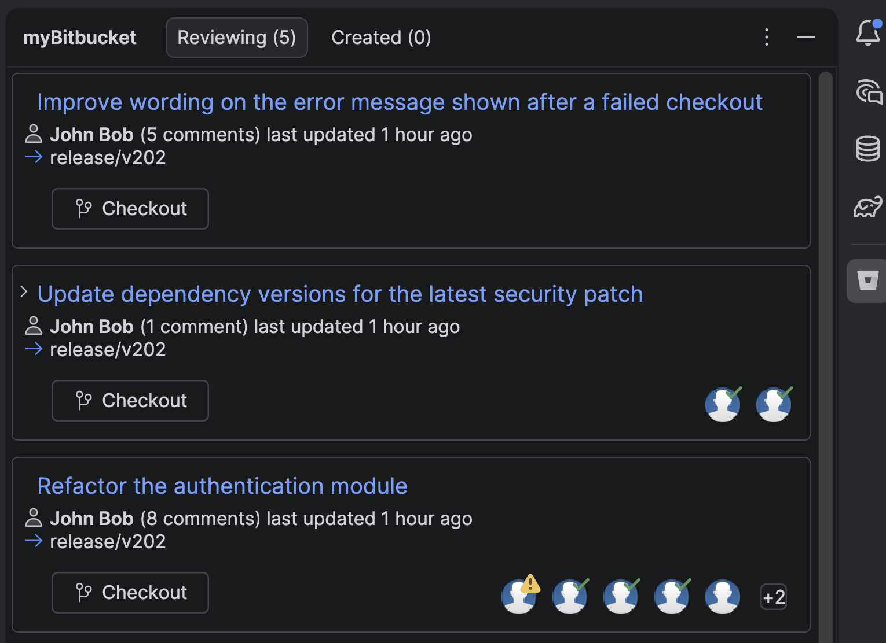

# myBitbucket

This plugin for IntelliJ IDEA lets you see, approve and merge your Bitbucket Server pull requests without leaving the IDE. It's integrated with Git so you can checkout the corresponding branch straight from a pull request card.

## Configuring the plugin
To configure the plugin open Idea's Settings window, navigate to the **myBitbucket** section and paste a link to your repository (or to any pull request in it) into the Repository URL field — the base url, project and repository name are parsed out of it automatically.

The plugin authenticates using an **Access Token** (requires Bitbucket Server 5.5 or higher). To generate one from within Bitbucket Server go to _Manage account > Account settings > HTTP access tokens_. Create a token with **Write** permission to be able to approve and merge pull requests from the plugin. Paste it into the Access Token field and hit OK — the plugin should now show your pull requests.

## Dependencies
Requires “Git Integration” plugin to be enabled to use Git checkout.

## Working with servers that use a self-signed certificate
The plugin performs remote http requests to Bitbucket Server, if your Bitbucket Server uses a self-signed certificate, it needs to be imported into the JetBrains Runtime that Idea ships with (look for a `jbr` folder inside the IDE installation). Use [keytool](https://docs.oracle.com/javase/tutorial/security/toolfilex/rstep1.html) to do that.

## Compatibility
The plugin targets IntelliJ IDEA 2023.3 and newer, and is expected to work with any Bitbucket Server that implements Bitbucket Server REST API 1.0. Was tested using IDEA 2026.2.

## Reporting an issue
If you find any issue, please report it to [GitHub](https://github.com/BigBurritoInc/BitbucketHelper4Idea/issues) or [email us](mailto:bitbucket.plugin@gmail.com)
